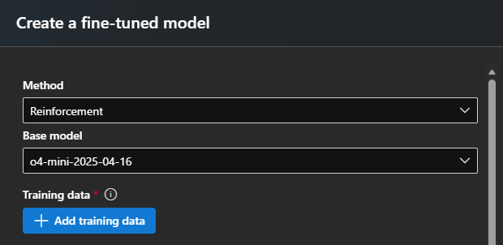
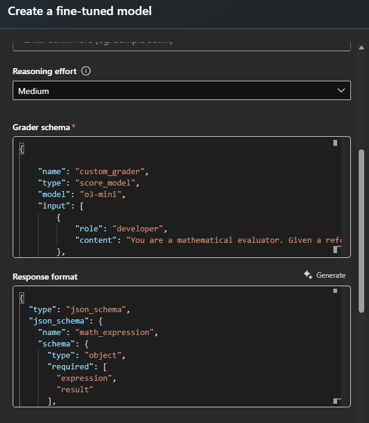
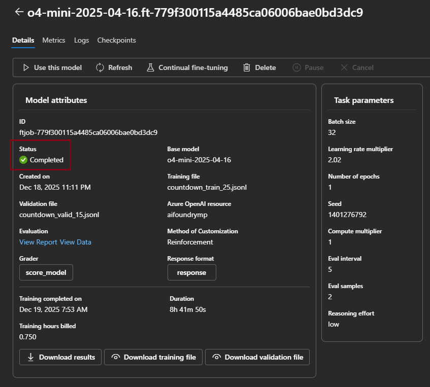
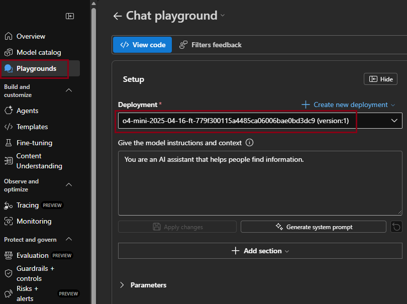
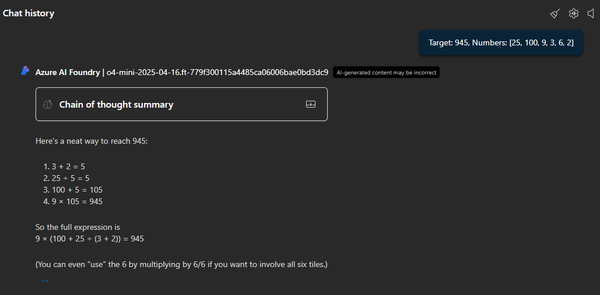

## Fine-Tuning GPT-4o-mini Model with RFT- An AI Foundry Dashboard Experience

Learn how to fine-tune a **gpt-4o-mini** model using **Reinforcement Fine-Tuning (RFT)** in Microsoft Foundry UI Dashboard.

Authors:
* He Zhang
* Marco Prado
* PG team

**Acknowledgements:**

* This notebook has been inspired by the [Microsoft PG Repository and demo](https://github.com/microsoft-foundry/fine-tuning/tree/main/Demos/RFT_Countdown).
* This project utilizes the Predibase **Countdown** [Countdown dataset](https://huggingface.co/datasets/predibase/countdown).

---

### Use Case

In this demo, we use the **Countdown** dataset from Predibase. This dataset is a synthetic reasoning dataset designed to evaluate and train large language models on multi-step mathematical reasoning and planning.

Each example contains:
- A **target number** (e.g., 97)
- A **list of four integers** (e.g., [53, 99, 45, 37])

The model’s task is to generate an arithmetic expression using those four numbers to match (or get close to) the target.

**Example:**

`(99 - ((53 + 37) / 45)) ≈ 97`

#### 🔧 Additional Constraint

We make the task stricter:

> **All four numbers must be used exactly once** in the final expression.

This encourages:
- Structured, multi-step reasoning  
- Full utilization of all inputs  
- Output formats that generalize well

#### Why This Is a Perfect Fit for RFT

This task is **not ideal for Supervised Fine-Tuning (SFT)**, which requires exact output labels. Here:
- There are **many valid outputs** per input
- **Evaluating correctness is easy**, but **generating the correct form is hard**
- Reward-based learning works far better than forcing the model to mimic a single path

With RFT:
- The model learns from **graded outcomes** instead of fixed answers
- We can **reinforce desired behavior** using numeric reward from a custom grader
- It's well suited for **low-data**, **high-structure** domains — like code, logic, or reasoning

---

### Prerequisites

* Learn the [what, why, and when to use fine-tuning.](https://learn.microsoft.com/en-us/azure/ai-services/openai/concepts/fine-tuning-considerations)
* An Azure subscription - [Create one for free.](https://azure.microsoft.com/free/cognitive-services)
* A [Microsoft Foundry project](https://learn.microsoft.com/en-us/azure/ai-foundry/how-to/create-projects) in Azure AI Foundry portal.
    * Fine-tuning access requires **Cognitive Services OpenAI Contributor** in the Microsoft Foundry resource.
    * A Microsoft Foundry resource created in a supported fine-tuning region (e.g. East US 2 or Sweden Central).
* A Training and Validation datasets:
  * At least 25 high-quality samples (preferably 100) are required.
  * Must be formatted in the JSON Lines (JSONL) document with UTF-8 encoding.

  ---

  ### Step 1: Open the *+Fine-tune model* wizard

1. Open Azure AI Foundry at [https://ai.azure.com/](https://ai.azure.com/) and sign in with credentials that have access to your Azure AI Foundry resource. In the **connected resources** tab, make sure that an Azure OpenAI resource is already connected to your AI Foundry Hub.

1. In Azure AI Foundry, choose an existing project or create a new project.
    <ol></ol>

1. Once we have our project created, browse to the **Fine-tuning** pane, and select **Fine-tune model**.  
    <ol></ol>

---

### Step 2: Select the *Base model*

1. In the **Base models** pane, choose **gpt-4o-mini** from the dropdown.

1. Click **Next** to proceed.  
    > 🧠 *gpt-4o-mini is optimized for low-latency inference and supports RFT.*  
    <ol></ol>

---

### Step 3: Upload your *Training data*

1. Choose your fine-tuning method: **Reinforcement**.

    * Vaidate the Base model: **o4-mini-yyyy-mm-dd**
    * Click the **Add training data** bottom to upload your training data using the following option:
    <ol></ol>

1. In the **Training data** section, select **Upload files** and then click the **Upload file** option.

1. Upload the [countdown_train_25.jsonl file](../sample_datasets/Countdown/countdown_train_25.jsonl):
    <ol></ol>

1. Click the **Apply** bottom.

---

### Step 4 (Optional): Add *Validation data*

Validation data is optional but recommended.

1. In the **Validation data** section, select **Add validation data**
1. In the **Validation data** section, select **Upload files** and then click the **Upload file** bottom.
1. Upload the [countdown_valid_15.jsonl file](../sample_datasets/Countdown/countdown_valid_15.jsonl)
    <ol></ol>
1. Click the **Apply** bottom.

---

### Step 5: Add the Grader Schema and Response format

1. Paste the content of the [grader_config_aoai.json file](../sample_datasets/Countdown/grader_config_aoai.json) in the **Grader schema** textbox.

1. Paste the content of the [response_schema.json file](../sample_datasets/Countdown/response_schema.json) in the **Response format** textbox.

    <ol></ol>

---

### Step 6 (Optional): Configure *Advanced options*

You can customize hyperparameters such as:

* Batch size
* Learning rate multiplier
* Number of epochs
* Samples for evaluation
* Evaluation interval
* Compute multiplier

Or leave them at default values.  

---

### Step 7: Review and *Submit*

1. Review your configuration.

1. Click **Submit** to start the fine-tuning job.

1. Monitor progress in the **Status** column of the **Fine-tuning** pane.

    > ⏱️ *Training duration depends on dataset size and selected parameters.*  
    <ol></ol>

1. When the fine-tuning process finishes, you will see the **Status** showing **Completed**.  
    <ol></ol>

---

### Step 8: *Deploy* your fine-tuned model

1. Once training is complete, select your new model in the **Fine-tuning** left pane.

1. Click **Use this model**.
    <ol></ol>

1. In the **Deploy model** dialog, enter a deployment name and click **Deploy**.  

    You can customize the options such as:

    * Deployment type
    * Tokens per Minute Rate Limit
    * Content filter

    Or leave them at default values.

    <ol></ol>

---

### Step 9: *Test and use* your deployed model

1. Use the **Playgrounds** in the left pane in Azure AI Foundry to test your model interactively.

1. Click **Try the Chat playground** option.

1. In the **Deployment** option, select the **new model name**
    <ol></ol>

1. Ask a query about a math problem. For example:

    * Target: 945, Numbers: [25, 100, 9, 3, 6, 2]

1. The response should be similar to this:
    <ol></ol>

---

### Step 10 (Optional): *Clean up* resources

Delete deployments, models, and datasets when no longer needed to avoid unnecessary costs.

---